# 纹脉华章

## 传统文化视觉智能创作与文创应用平台

让创作从一张参考图开始：选择传统文化风格，生成作品，阅读依据真实成图形成的文化说明，再预览、下载文创效果。

[](LICENSE)


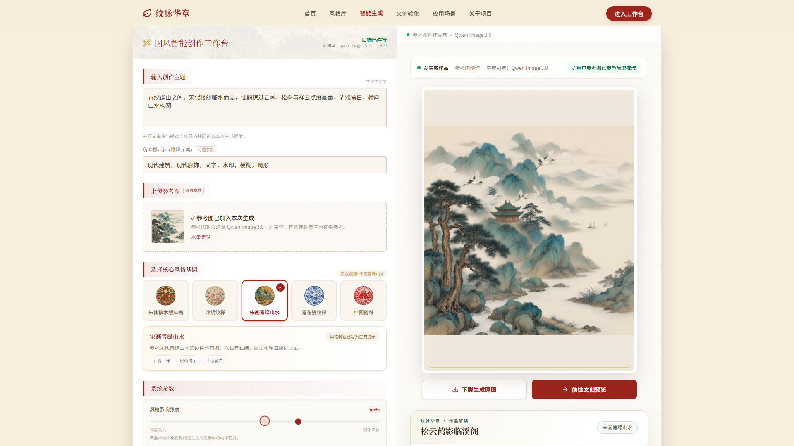

## 立即体验

- **[免配置浏览：五组真实案例与文化卡](https://3331083641-prog.github.io/wenmai-huazhang/#/gallery)**：无需密钥、无需安装模型。可看首页、五种风格、保存的生成作品、CultureCard 和文创预览，还可下载 PNG。在线展示不运行实时推理。
- **[源码下载](https://github.com/3331083641-prog/wenmai-huazhang/archive/refs/heads/main.zip)**：Windows 解压后双击 `setup_windows.cmd`，完成配置后双击 `start_windows.cmd`，自动打开产品。
- **[保留的 iCAN 视频与方案](https://github.com/3331083641-prog/wenmai-huazhang/releases/tag/v1.0.0)**：旧赛事 Release 和提交历史原样保留。

## 五组参考图 → 生成作品 → CultureCard

这里展示的是**已保存的真实生成案例**。模型请求携带对应参考图；作品生成后，本地 Ollama Qwen3-VL 读取实际成图，文化卡由应用下载按钮导出。各组参数、SHA-256、分析结果及来源见 [案例说明](docs/examples/README.md) 和 [素材来源](docs/examples/reference_sources.md)。

| 风格 / 作品 | 参考输入 | 真实 Qwen Image 3.0 作品 | 实际导出 CultureCard |
|---|---|---|---|
| 朱仙镇木版年画<br>瑞猫迎春 | [原尺寸](docs/examples/zhuxianzhen/reference.png)<br> | [原尺寸](docs/examples/zhuxianzhen/generated.png)<br>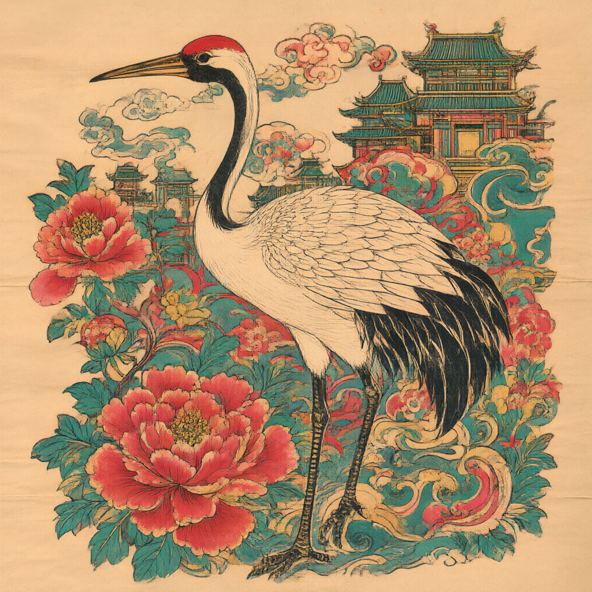 | [原尺寸](docs/examples/zhuxianzhen/culture_card.png)<br>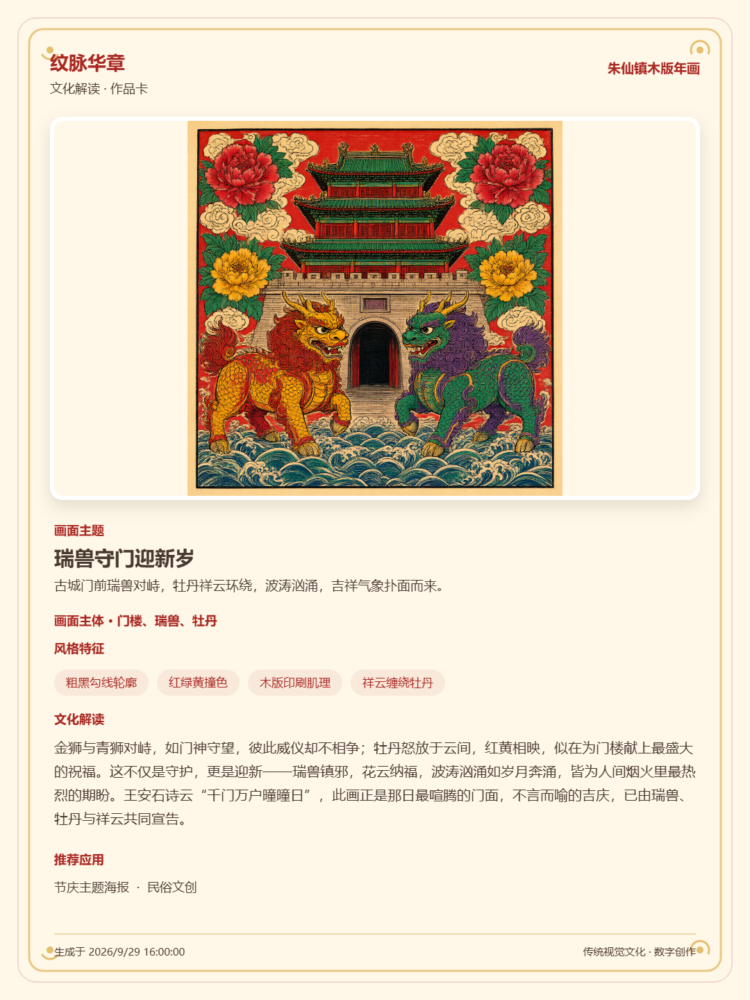 |
| 汴绣纹样<br>绣兔牡丹 | [原尺寸](docs/examples/bianxiu/reference.png)<br> | [原尺寸](docs/examples/bianxiu/generated.png)<br>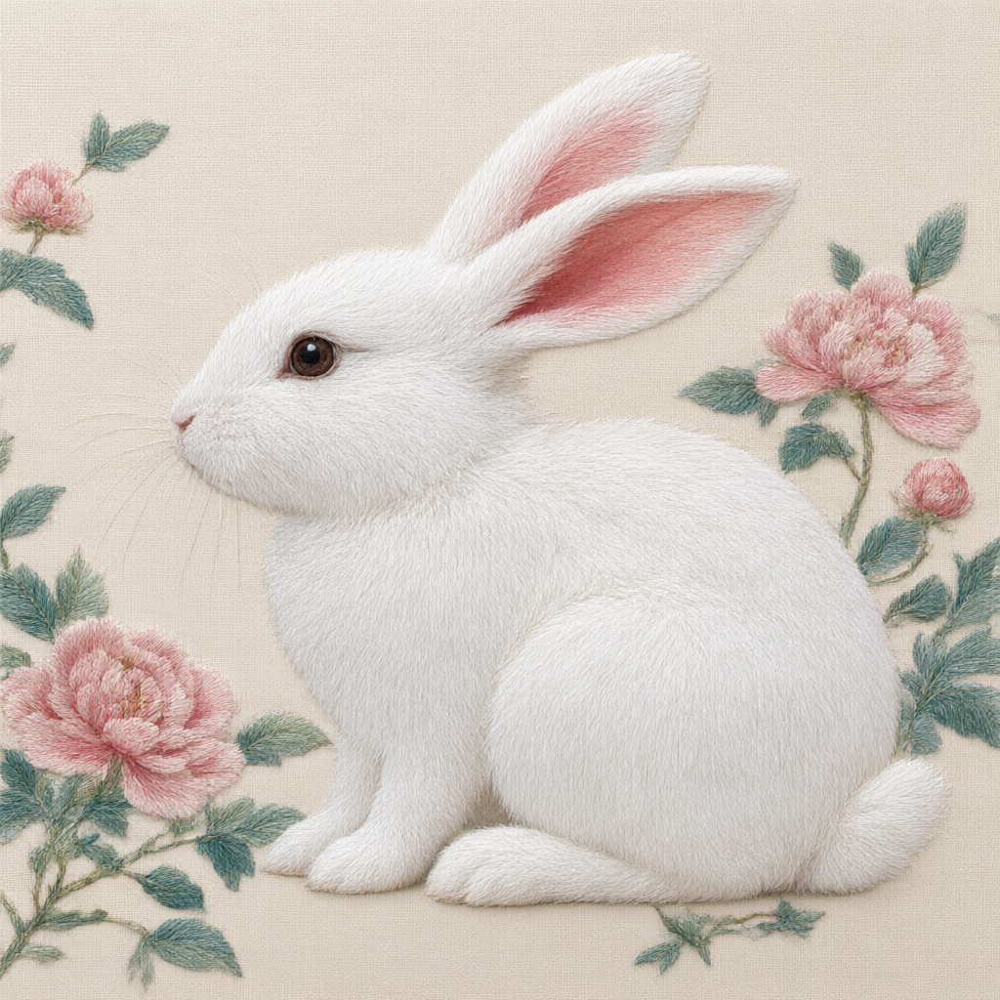 | [原尺寸](docs/examples/bianxiu/culture_card.png)<br>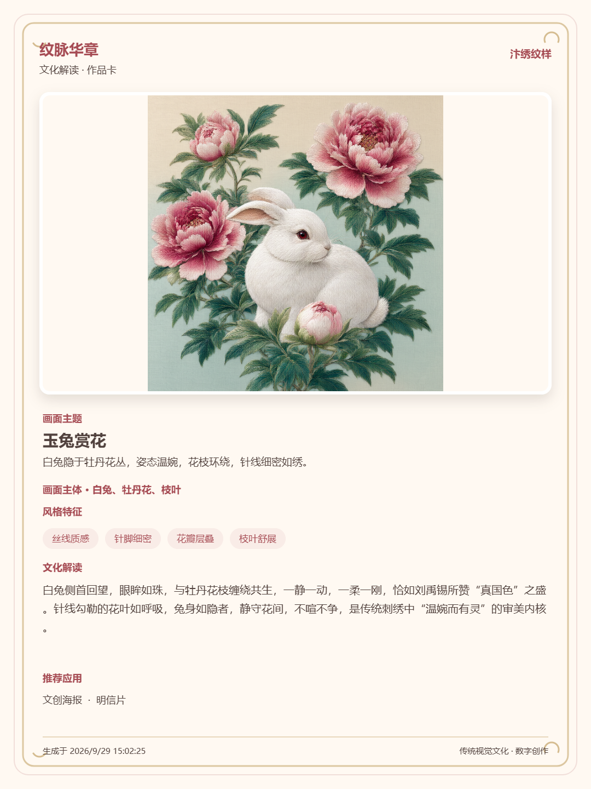 |
| 宋画青绿山水<br>云鹤临水楼 | [原尺寸](docs/examples/songhua/reference.png)<br>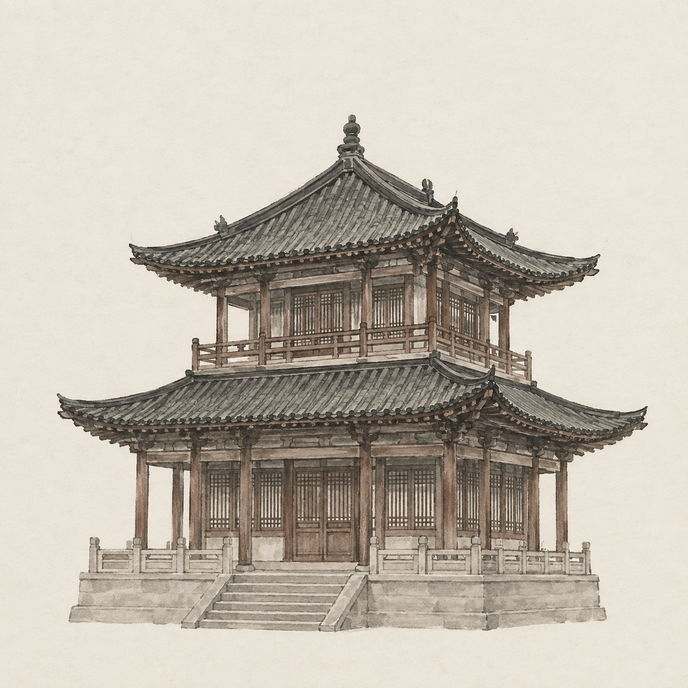 | [原尺寸](docs/examples/songhua/generated.png)<br>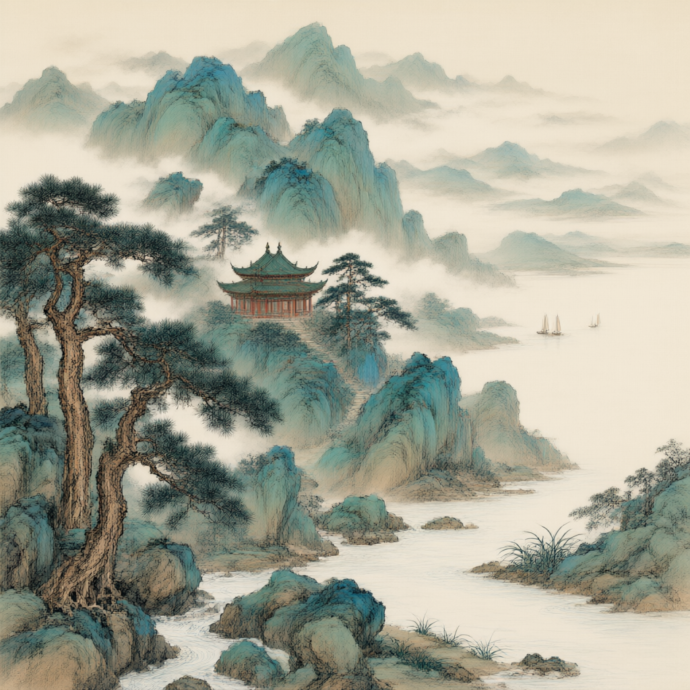 | [原尺寸](docs/examples/songhua/culture_card.png)<br>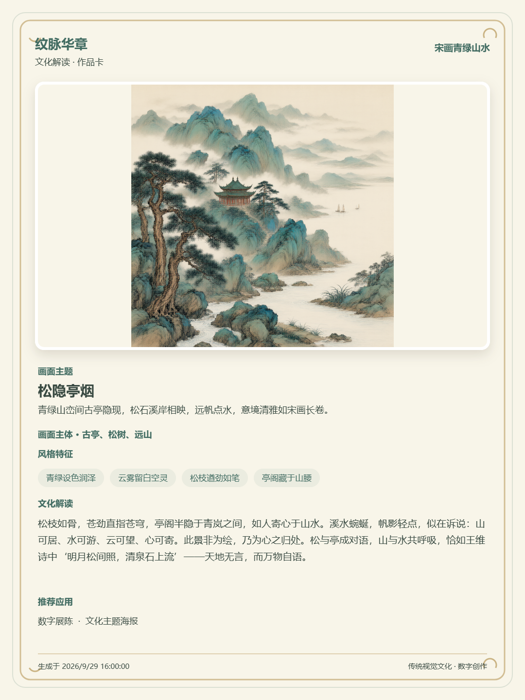 |
| 青花瓷纹样<br>青花蝶韵 | [原尺寸](docs/examples/qinghua/reference.png)<br> | [原尺寸](docs/examples/qinghua/generated.png)<br>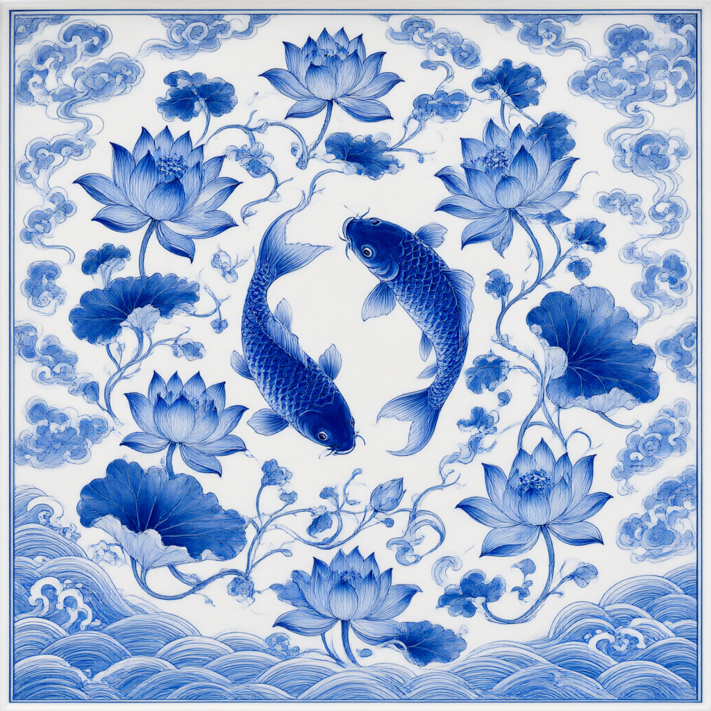 | [原尺寸](docs/examples/qinghua/culture_card.png)<br>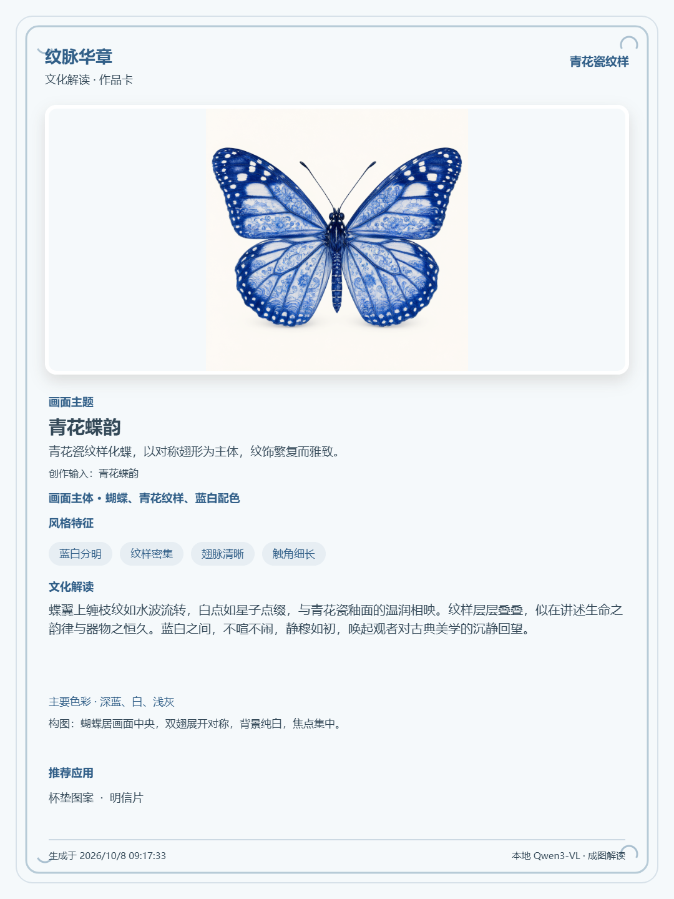 |
| 中国剪纸<br>剪影灵狐 | [原尺寸](docs/examples/jianzhi/reference.png)<br> | [原尺寸](docs/examples/jianzhi/generated.png)<br>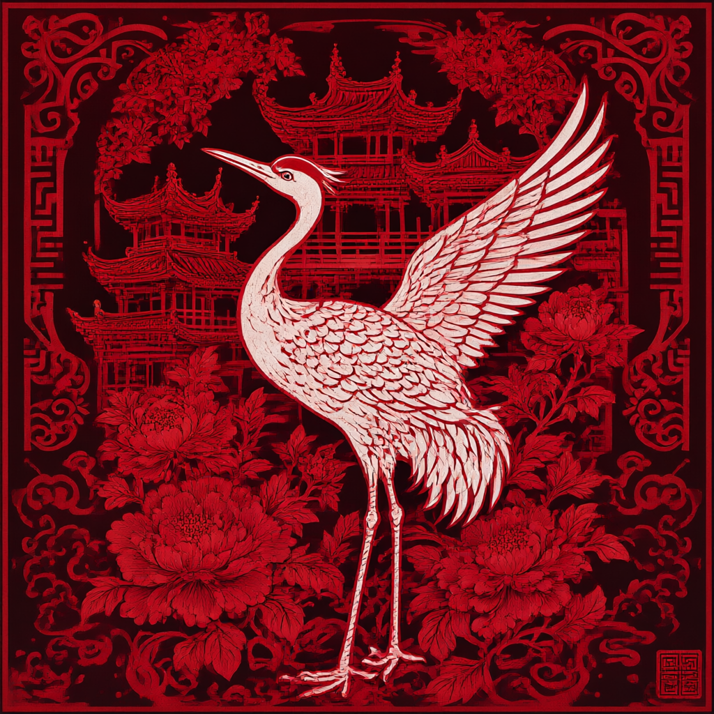 | [原尺寸](docs/examples/jianzhi/culture_card.png)<br>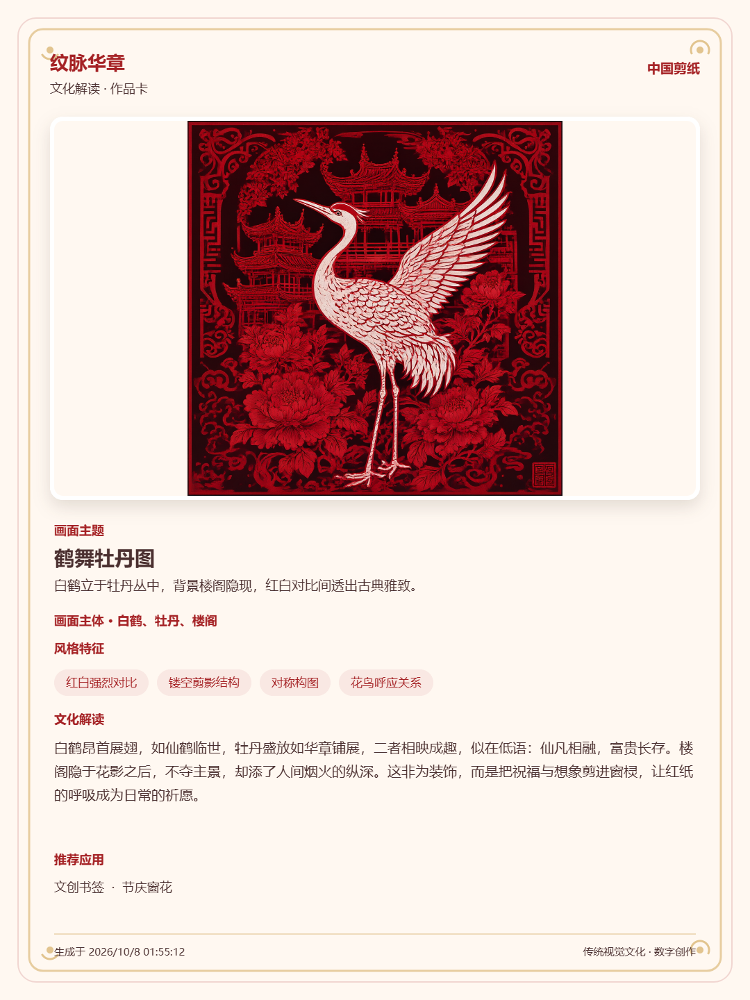 |

本次按用户最终选择，以白兔取代金鱼、以前真实生成的楼阁案例取代鹿。三个新主体参考图来自用户提供的 ChatGPT 图像；兔子参考图为授权新制作的 AI 写实素材；建筑图是用户此前提供的 AI 创作参考，不是历史实物照片。

## 核心功能

| 环节 | 已实现功能 |
|---|---|
| 风格库 | 朱仙镇木版年画、汴绣纹样、宋画青绿山水、青花瓷纹样、中国剪纸 |
| 创作控制 | 主题、可选主体保持、上传参考图、负向提示、风格提示强度、构图与用途 |
| 图像生成 | 百炼 `qwen-image-3.0`，支持主题与用户图像联合输入；不默认回退 mock |
| 图像理解 | 本地 `qwen3-vl:4b-instruct-q4_K_M` 读取真实生成图 |
| CultureCard | 画面主体、风格特征、文化解读、色彩构图、应用建议、1080 × 1440 PNG |
| 文创预览 | 明信片、海报、帆布袋、书签、杯垫、手机分享图、展陈屏、纪念票；1600 × 1200 PNG 下载 |
| 案例浏览 | 无模型也可看真实案例，加载保存记录后可使用文创预览 |

文创展示使用载体模板，是设计效果预览。风格强度调整的是 Prompt 对风格的强调，不是训练或图像相似度指标。

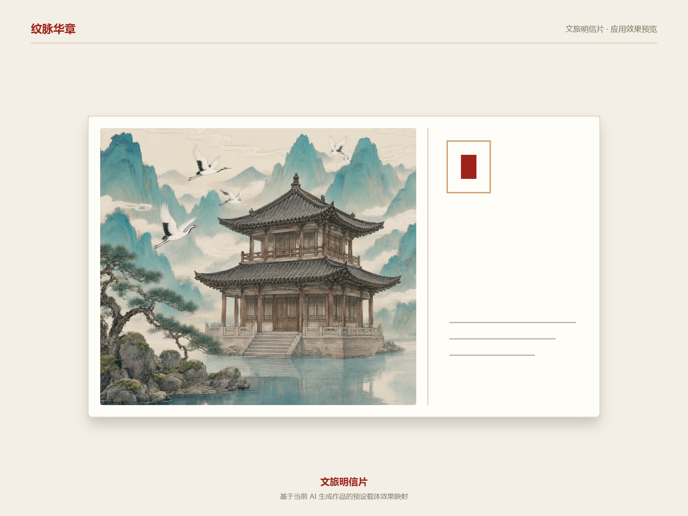

## 技术路线

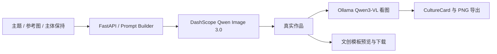
```mermaid
flowchart LR
  A[主题 / 参考图 / 主体保持] --> B[FastAPI / Prompt Builder]
  B --> C[DashScope Qwen Image 3.0]
  C --> D[真实作品]
  D --> E[Ollama Qwen3-VL 看图]
  E --> F[CultureCard 与 PNG 导出]
  D --> G[文创模板预览与下载]
```

React 19 / Vite / TypeScript 前端，FastAPI / Pillow / Requests 后端。主体保持是可选的通用约束，不在全局禁止某种动物。`assets/style_refs/` 是文化风格展示素材源；`docs/examples/*/reference.png` 是各生成实验的主体输入，两者分开管理。

## Windows 快速启动

前提：Python 3.10+，Node.js 20.19+ 或 22.12+，npm；实时文化理解另需 Ollama。启动脚本不会安装系统软件、下载大模型或修改系统环境。

1. 双击 `check_environment.cmd` 检查环境。
2. 首次双击 `setup_windows.cmd`，安装项目依赖、准备兼容素材目录；缺少配置时从示例建立私有 `.env`。
3. 在本机编辑 `backend/.env`，填入**自己的**百炼 Key 和北京业务空间 URL。
4. 需要看图解读时，自行安装并启动 Ollama，执行 `ollama pull qwen3-vl:4b-instruct-q4_K_M`。
5. 双击 `start_windows.cmd`；自动检查健康状态、寻找空闲端口并打开浏览器。默认优先 8000 / 5173，冲突时在限定端口范围内选择，前后端地址自动保持一致。
6. 双击 `stop_windows.cmd`，只关闭该启动器记录且创建时间匹配的项目进程，不停止共享 Ollama 或其他项目。

没有 API Key 或本地视觉模型也可浏览“真实案例”并进行文创预览。实时生成需要密钥；文化模型不可用时显示模板回退，绝不标记为看图分析成功。静态在线模式主动关闭实时生成入口。

## 完整模型配置

`backend/.env.example` 包含配置模板。**不要上传自己的 `.env`。**

```dotenv
GENERATION_PROVIDER=dashscope_qwen_image
ALLOW_MOCK_FALLBACK=false
DASHSCOPE_API_KEY=填写个人密钥
DASHSCOPE_BASE_URL=填写北京业务空间专属HTTPS地址
DASHSCOPE_IMAGE_MODEL=qwen-image-3.0
QWEN_VL_ENABLED=true
QWEN_VL_BASE_URL=http://127.0.0.1:11434
QWEN_VL_MODEL=qwen3-vl:4b-instruct-q4_K_M
QWEN_VL_TIMEOUT=180
```

阿里云图像服务可能产生调用费用，评委须使用自己的账户；仓库和在线展示没有开发者密钥。`/health` 的“配置就绪”不代表已经发起计费网络验证，实际调用结果以 `/generate` 为准。

手动运行：在 `backend` 执行 `venv/Scripts/python.exe -m uvicorn app:app --host 127.0.0.1 --port 8000`；在 `frontend` 执行 `npm ci` 和 `npm run dev`。自定义端口时设置 `VITE_API_BASE_URL`。

## 真实生成验证

先 `/health`，再 `/generate`，再前端开发服务及浏览器验证。本轮生成与复用情况记录在各组 `metadata.json`。接口只在服务 usage 确认输入图像后报告 `referenceImageUsed=true`；生成失败不偷偷替换成图片。静态案例加载在 UI 中明确标记为保存记录。

## 测试与限制

```powershell
backend/venv/Scripts/python.exe -m unittest discover -s tests -v
cd frontend
npm run lint
npm run build
```

浏览器验收和本机运行截图见 [验收报告](docs/AIC_GALLERY_AND_JUDGE_EXPERIENCE_ACCEPTANCE.md)。测试网络桩仅用于失败状态和请求载荷检查，不作为真实生成证据。重跑可选浏览器验收需自行安装 Playwright，并使用本机 Edge；它不属于产品运行依赖。

输出会受到生成模型影响，主体保持和负向词不保证绝对生效：年画猫仍出现可读题字，已在审核记录中保留。文化解读是模型依据画面形成的审美阐释，不是经过史料认证的历史结论。在线服务不托管模型后端。

## 赛事版本与许可

当前为通用产品体验版本，保留此前 iCAN Release。计划参加 2026 全球校园人工智能算法精英大赛智能文化算法主题赛；已有原型参加其他比赛后，升级版本的原创性资格**仍需组委会确认**，本仓库不声称资格已满足。

项目原创代码采用 [MIT](LICENSE)，既有声明按 [第三方说明](THIRD_PARTY_NOTICES.md) 保留。模型和素材不由 MIT 重新授权；新参考图不沿用旧公开图片的 CC0 / 公有领域声明。[素材职责说明](assets/README.md)。
