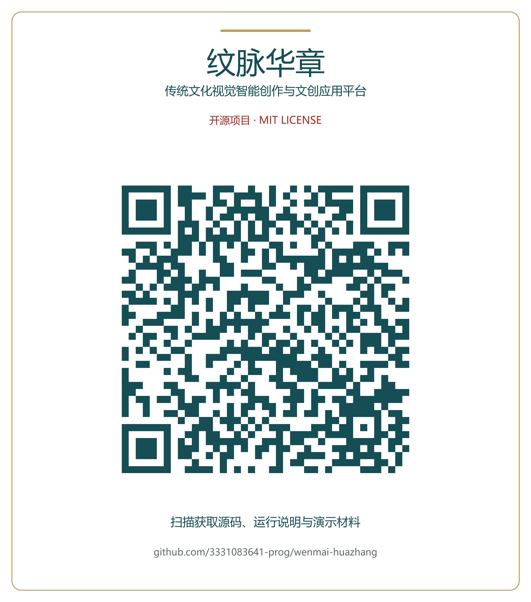
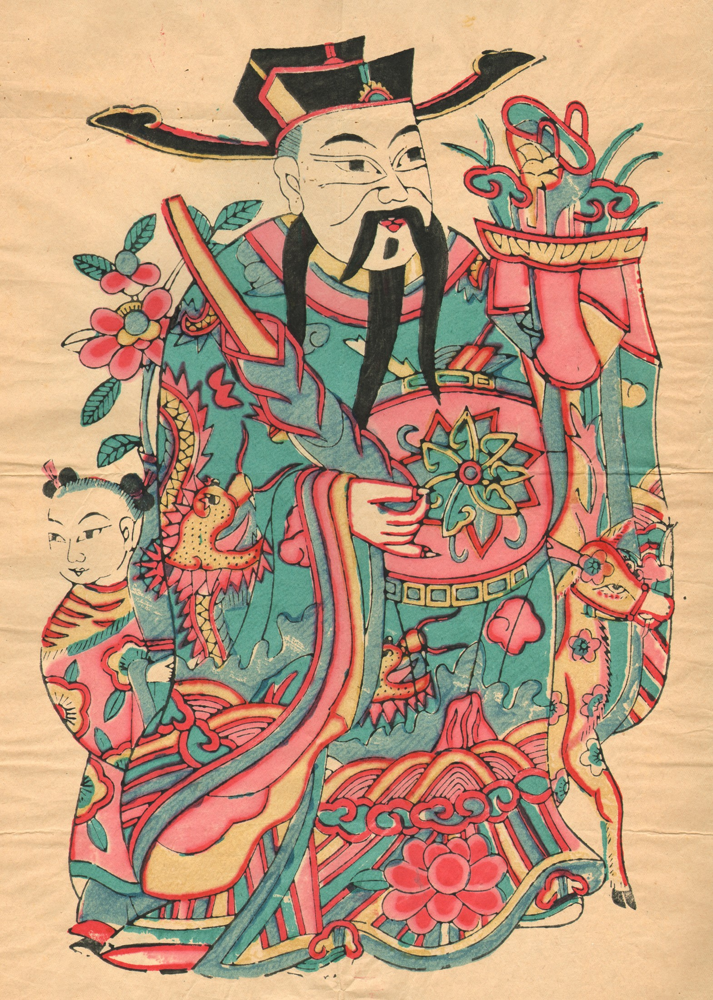
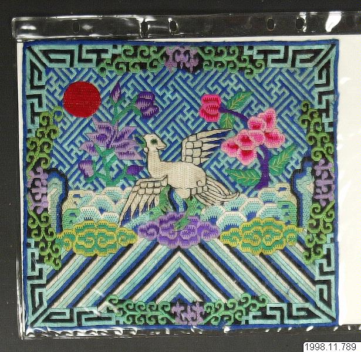
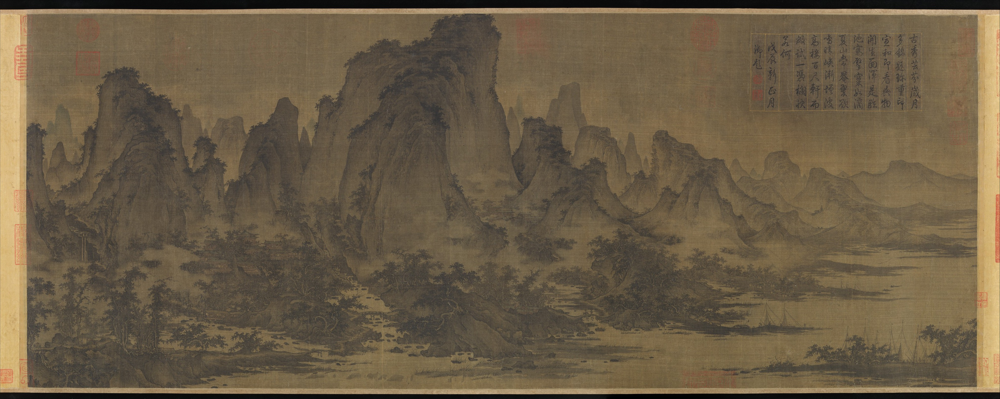
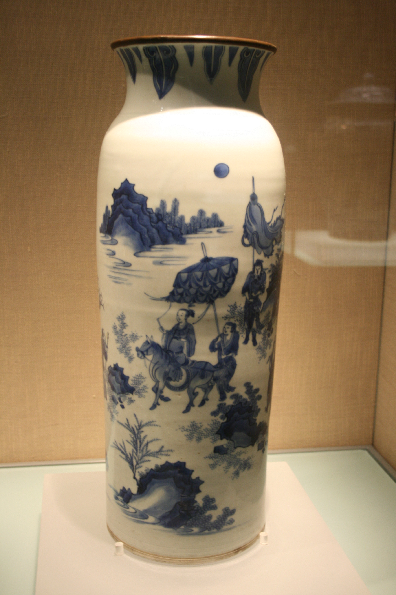
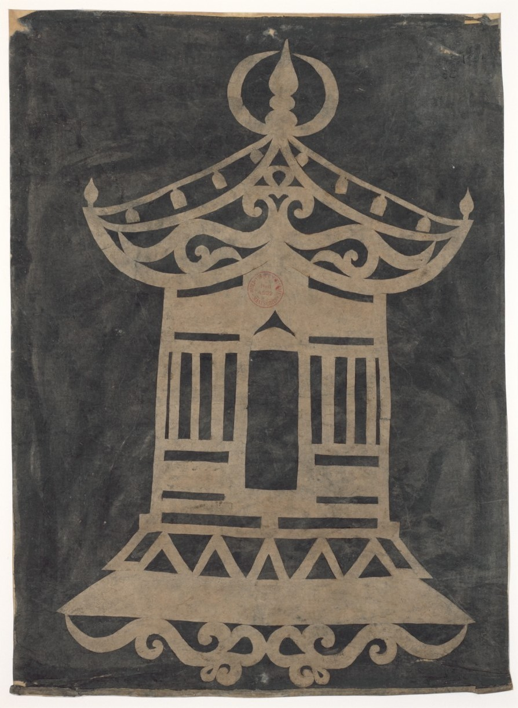
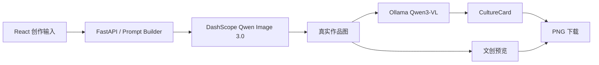

# 纹脉华章

### 传统文化视觉智能创作与文创应用平台

[](LICENSE)


让传统文化从“被观看”走向“被共创”。输入创作主题，选择文化视觉风格，生成作品，阅读与成图对应的文化说明，再将作品用于文创载体预览和下载。


## 演示与下载

[比赛演示视频、应用方案与源码包](https://github.com/3331083641-prog/wenmai-huazhang/releases/tag/v1.0.0)展示完整的真实操作流程。4分25秒演示包含主题与参考图输入、风格及负向约束、Qwen Image 生成、本地 Qwen3-VL 解读、CultureCard、文创预览和实际下载。



二维码由 [python-qrcode](https://github.com/lincolnloop/python-qrcode) 生成，直接指向本仓库。它提供源码入口，应用需按下文说明在本机运行。

## 功能说明

| 环节 | 已实现功能 |
|---|---|
| 风格选择 | 朱仙镇木版年画、汴绣纹样、宋画青绿山水、青花瓷纹样、中国剪纸 |
| 创作控制 | 主题、参考图、负向提示、风格影响强度、构图模式、输出用途 |
| 图像生成 | DashScope `qwen-image-3.0`，支持文字与可选参考图联合输入 |
| 作品理解 | Ollama 本地 `qwen3-vl:4b-instruct-q4_K_M` 读取真实成图 |
| CultureCard | 作品标题、文化来源、视觉特征、象征含义、应用场景及 PNG 导出 |
| 文创应用 | 预设载体效果预览；明信片、海报、帆布袋效果图下载 |
| 作品保存 | 原图下载、浏览器近期记录及创作参数恢复 |

风格影响强度通过 Prompt 对视觉特征的强调程度实现。文创输出是效果预览文件。基础图像与视觉模型均由第三方提供，项目实现文化资料组织、交互、服务集成及应用工作流。

## 五类风格的真实作品与文化说明卡

以下参考图、生成作品及 CultureCard 来自本项目的真实工作流。五种风格分别使用公开参考图进行图生图，生成结果再交由本地 Qwen3-VL 解读；每张文化说明卡均从应用界面单独导出。图片来源和许可记录见[参考图来源说明](docs/examples/reference_sources.md)。

| 风格 | 参考输入 | Qwen Image 3.0 生成作品 | CultureCard |
|---|---|---|---|
| 朱仙镇木版年画 | [原图](docs/examples/zhuxianzhen/reference.jpg)<br> | [作品](docs/examples/zhuxianzhen/generated.png)<br> | [文化卡](docs/examples/zhuxianzhen/culture_card.png)<br> |
| 汴绣纹样 | [原图](docs/examples/bianxiu/reference.jpg)<br> | [作品](docs/examples/bianxiu/generated.png)<br> | [文化卡](docs/examples/bianxiu/culture_card.png)<br> |
| 宋画青绿山水 | [原图](docs/examples/songhua/reference.jpg)<br> | [作品](docs/examples/songhua/generated.png)<br> | [文化卡](docs/examples/songhua/culture_card.png)<br> |
| 青花瓷纹样 | [原图](docs/examples/qinghua/reference.jpg)<br> | [作品](docs/examples/qinghua/generated.png)<br> | [文化卡](docs/examples/qinghua/culture_card.png)<br> |
| 中国剪纸 | [原图](docs/examples/jianzhi/reference.jpg)<br> | [作品](docs/examples/jianzhi/generated.png)<br> | [文化卡](docs/examples/jianzhi/culture_card.png)<br> |

完整的原尺寸文件及本次生成说明见 [`docs/examples`](docs/examples/README.md)。素材各自遵循来源许可，不随项目代码采用的 MIT 许可改变。

## 技术结构



前端：React 19、Vite 6、TypeScript、Tailwind CSS 4、React Router 7、Motion。后端：FastAPI、Pydantic、Pillow、DashScope。

## 快速开始

需要 Python 3.10+、Node.js 20.19+（或 22.12+）、npm 和 Ollama。完整的图像生成需要用户自己的阿里云百炼 API Key；模型服务的调用按服务商规则计费。

```bash
git clone https://github.com/3331083641-prog/wenmai-huazhang.git
cd wenmai-huazhang
```

### 1. 本地视觉模型

安装并启动 [Ollama](https://ollama.com)，下载视觉模型：

```bash
ollama pull qwen3-vl:4b-instruct-q4_K_M
```

Ollama 默认监听 `http://127.0.0.1:11434`。运行需要足够的内存／显存，具体取决于模型和设备。

### 2. 后端

Windows PowerShell：

```powershell
python -m venv backend/venv
./backend/venv/Scripts/python.exe -m pip install -r backend/requirements.txt
Copy-Item backend/.env.example backend/.env
# 编辑 backend/.env，填入 DASHSCOPE_API_KEY 和业务空间专属 DASHSCOPE_BASE_URL
./scripts/start_backend.ps1
```

macOS / Linux：

```bash
python3 -m venv backend/venv
backend/venv/bin/python -m pip install -r backend/requirements.txt
cp backend/.env.example backend/.env
# 编辑 backend/.env，填入 DASHSCOPE_API_KEY 和业务空间专属 DASHSCOPE_BASE_URL
cd backend
./venv/bin/python -m uvicorn app:app --host 127.0.0.1 --port 8000
```

打开 `http://127.0.0.1:8000/health`，确认图像 provider 与本地视觉模型状态。接口文档：`http://127.0.0.1:8000/docs`。

### 3. 前端

另开终端，在项目目录运行：

```bash
cd frontend
npm ci
npm run dev
```

打开 `http://localhost:5173`。前端 API 地址默认是 `http://127.0.0.1:8000`，可通过 `frontend/.env.local` 中的 `VITE_API_BASE_URL` 修改。

## 使用流程

1. 进入智能生成页，填写主体、位置关系和创作主题。
2. 选择五类文化视觉风格之一，按需上传 JPG／PNG 参考图。
3. 设置负向提示、风格影响强度、构图模式与输出用途。
4. 点击生成，等待真实服务返回作品及图像理解结果。
5. 检查主图和 CultureCard，进入文创转化页查看载体效果。
6. 下载原图、文化卡或文创效果图。

图像理解服务不可用时，系统保留已生成图，卡片标明模板回退来源。正式默认配置禁止用模拟图替代失败的生成请求。

## 目录

```text
backend/       FastAPI、Prompt Builder、provider、图像理解
frontend/      React 应用、风格库、CultureCard、文创预览
assets/        风格参考与素材说明
docs/          架构、使用文档、真实界面及示例
scripts/       可移植的启动脚本
licenses/      保留的第三方许可证
```

已保存的正式案例覆盖五类风格生成、真实成图理解、CultureCard 和三类文创下载，详情见 [案例说明](docs/examples/README.md)。开源目录不包含本机密钥、依赖目录、模型权重、运行缓存或历史备份。

## 文档与参赛材料

- [架构与接口](docs/architecture.md)
- [部署与常见问题](docs/running.md)
- [第三方许可与素材](THIRD_PARTY_NOTICES.md)
- [参赛发行版](https://github.com/3331083641-prog/wenmai-huazhang/releases)

本项目参加 2026 iCAN 大学生创新创业大赛 AI 应用创新挑战赛软件赛道。仓库链接用于获取源码，并非已部署的在线应用地址。

## 许可证

项目原创代码采用 [MIT](LICENSE)。已有文件中的 Apache-2.0 声明保留，适用文件和许可证副本见 [第三方说明](THIRD_PARTY_NOTICES.md)。图片、模型及外部服务不自动随代码许可证授予权利，具体素材说明见 `assets/README.md`。
