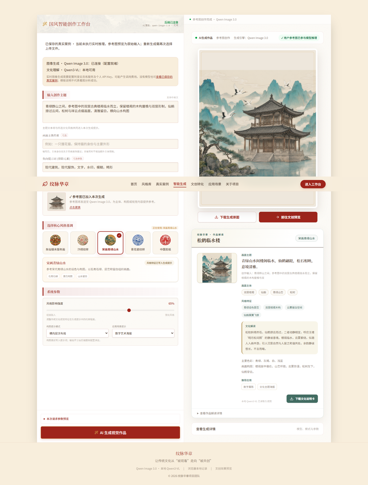
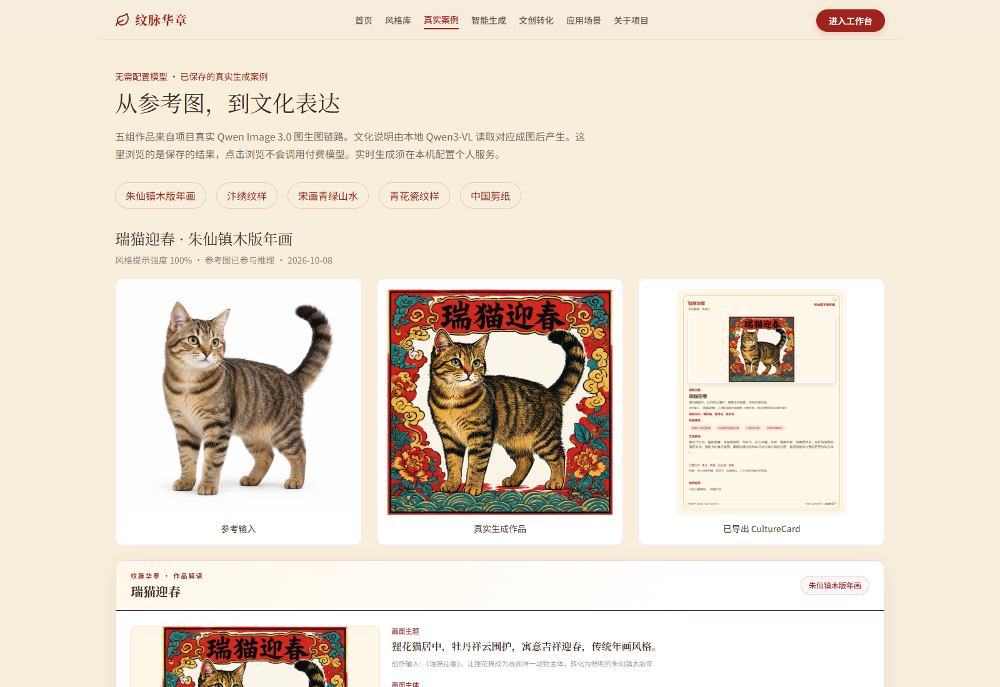
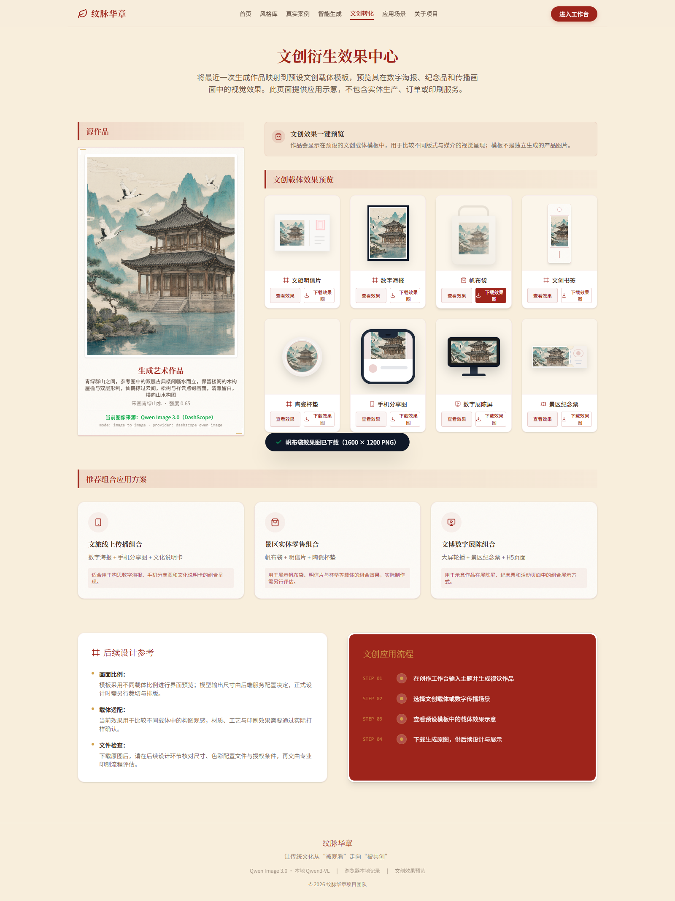
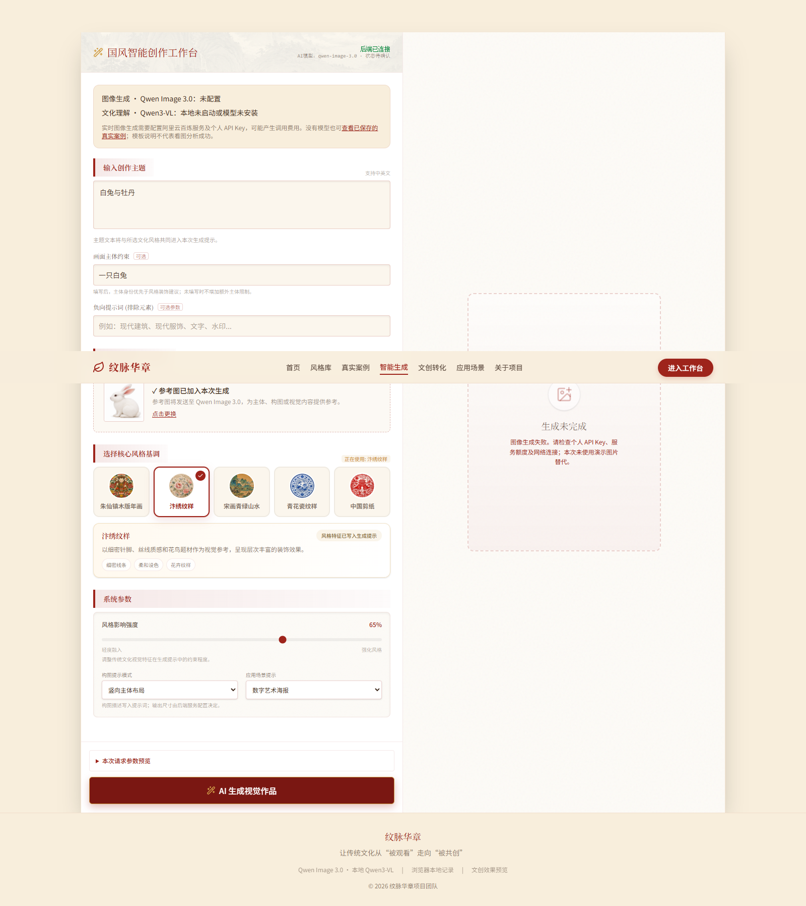

# AIC 真实案例与评委体验验收

验收日期：2026-10-08。基线提交：`de2dd12e4e94688e2db46396c05fd687c18866cb`。开发分支：`codex/aic-judge-experience`。本次不修改旧 iCAN Release 或历史提交。

## 当前正式案例

用户后续要求取代了最初的金鱼、梅花鹿展示方案。最终五组为：

| 风格 ID | 原始输入 | 当前作品 | 图像生成 | 参考参与 | CultureCard |
|---|---|---|---|---|---|
| zhuxianzhen | 用户白底狸花猫 | 瑞猫迎春，100%提示强度 | 本轮真实 Qwen Image 3.0 加强生成 | true，usage 输入1张 | 本地Qwen3-VL读取当前成图，应用按钮导出 |
| bianxiu | 新制作白底写实兔子 | 绣兔牡丹，100%提示强度 | 用户授权后通过现有项目重新生成 | true，usage 输入1张 | 本地Qwen3-VL读取新兔子成图，应用按钮导出 |
| songhua | 用户此前双层古典建筑图 | 云鹤临水楼，65%提示强度 | 复用2026-09-30真实视频案例，不冒充新推理 | 保留响应true；usage数量未留存，记null | 本轮重新看图解读，应用按钮导出 |
| qinghua | 用户白底蝴蝶 | 青花蝶韵，65%提示强度 | 本轮真实 Qwen Image 3.0 | true，usage 输入1张 | 本地Qwen3-VL读取成图，应用按钮导出 |
| jianzhi | 用户白底赤狐 | 剪影灵狐，65%提示强度 | 本轮真实 Qwen Image 3.0 | true，usage 输入1张 | 本地Qwen3-VL读取成图，应用按钮导出 |

本任务累计执行原始五次、授权加强三次、授权新兔子一次，共九次真实图像生成；被用户替换的金鱼、鹿和旧兔子配对不再展示，原始记录保存在本机备份。没有额外计费重试。最终展示是四个本轮新生成结果和一个真实历史结果，不是五次实时请求的伪装展示。

生成模型：DashScope `qwen-image-3.0`。分析模型：Ollama 本地 `qwen3-vl:4b-instruct-q4_K_M`。生成图1024×1024 PNG；文化卡1080×1440 PNG。各目录metadata记录实际输入、输出、卡片SHA-256、模型、参数和真实分析。文化卡的图像哈希与对应作品一致。

## 修改范围

- `backend/app.py`、`prompt_builder.py`：可选通用主体保持字段；优先保留主体，不全局禁止仙鹤。
- `backend/providers/dashscope_qwen_image_provider.py`：保存前验证真实PNG，继续单次提交及严格参考参与检查。
- `backend/services/vision_analysis.py`：依据可见画面解释，不编造历史依据；模型失败仍显式回退。
- `backend/provider_service.py`、`image_analyzer.py`、`instantstyle_service.py`：支持隔离配置文件，默认私有配置不变；可真实验证无密钥环境。
- 前端：真实案例页、保存记录提示、文化卡色彩构图导出、生成服务状态和费用提示、错误内容清理；首页/关于页改成通用产品介绍。保留五类风格选择、创作控制和文创下载。
- `setup_windows.cmd`、`start_windows.cmd`、`stop_windows.cmd`、`check_environment.cmd`及PowerShell启动器：项目依赖与服务管理。
- README、五组案例与来源说明、素材审计、测试、运行截图、GitHub Pages工作流。

## 评委两种体验

**免配置浏览：** [在线真实案例页](https://3331083641-prog.github.io/wenmai-huazhang/#/gallery)。静态首页、五种文化风格、五组输入/成图/文化卡、文创预览和PNG下载。实时生成明确不可用，网站不包含个人Key。部署结果在末尾记录。

**本地完整系统：** 首次双击setup，私下配置个人百炼账户；需要实时看图时自行安装Ollama模型，再双击start。启动器实际检查health后运行前端，自动避开占用端口并设置一致的API地址。stop只关闭自己记录且创建时间一致的进程，不关闭共享Ollama。未安装系统软件或大型模型。

## 已执行验收

| 检查 | 结果 / 证据范围 |
|---|---|
| 真实后端 `/health` → `/generate` | 真实生成链路成功，主provider和模型正确；新兔子输入参与得到usage确认 |
| 20项Python轻量测试 | 通过；输入存在/映射/哈希/有效PNG、五类请求数据、严格参考标志、失败不mock、VL失败保留图像并标记模板、卡片配对、README图片链接、Windows路径与PID安全、素材职责 |
| TypeScript `npm run lint` | 通过 |
| 前端 `npm run build` | 本地模式与Pages静态模式均成功；有500KB JavaScript包体积建议警告，无构建错误 |
| 浏览器页面 | 首页、风格库、工作台、文创、应用场景、关于、五组案例页实际加载，图片有效，无页面脚本错误 |
| 实际CultureCard导出 | 通过应用按钮逐张下载五张PNG，非另画静态仿卡 |
| 文创预览和下载 | 应用实际下载明信片和帆布袋1600×1200 PNG |
| 无API Key、无视觉模型 | 使用独立真实后端配置验证；UI实际提交失败并显示安全提示，不产生计费；上传的参考图字节和主体约束核对正确 |
| 无模型案例浏览 | 隔离后端和浏览器状态检查通过，保存案例仍可看，不标成当前模型推理 |
| 纯静态生产站 | 所有后端请求被阻断时，五组案例、首页、风格库、应用场景、关于和文创下载通过 |
| Windows启动/停止 | 启动器已真实启动前后端、健康检查成功，停止器按记录关闭自身进程 |
| Windows首次setup | 在本机实际完成pip依赖检查、npm ci、风格素材准备和环境检查；未下载大型模型 |

安装审计发现source-map-js旧锁定版本的已公开问题，已将该间接依赖锁定更新至1.2.2；更新后npm audit报告0项漏洞。问题与修订版本见[官方仓库公告](https://github.com/7rulnik/source-map-js/releases/tag/v1.2.2)。setup中的既有清华镜像出现一次SSL版本检查警告，但所需Python依赖已满足，setup退出成功；没有关闭证书校验。

浏览器验收脚本：`scripts/verify_aic_browser.py`、`verify_unconfigured_runtime.py`、`verify_static_showcase.py`；可选开发验收需要本机Playwright和Edge。产品运行不要求Playwright。

轻量测试使用项目后端虚拟环境运行：`backend\venv\Scripts\python.exe -m unittest discover -s tests -p test_aic_delivery.py`，最终复核20项通过。系统Python未安装后端依赖，不能直接用系统Python替代该测试命令。

## 运行截图

## 来源、素材与限制

- 参考来源详见[当前素材说明](examples/reference_sources.md)：三个用户ChatGPT原始动物图、新授权imagegen写实兔子参考、用户原有AI建筑参考。不沿用旧CC0或公有领域声明。
- 兔子参考为AI写实图，不是假称实拍照片。兔子生成作品由项目Qwen Image真实产生，两个来源清楚区分。
- 猫图有可读题字，说明负向词并非绝对约束；不隐藏该真实输出。楼阁案例主题本来要求仙鹤，因此保留原有画面。
- 宋式楼阁参考不被认定为真实宋代文物；文化解读是看图后的审美解读，不是历史鉴定。
- 风格提示强度不是模型原生风格权重或统计准确率。文创图是载体模板效果，不声称供应链或实际销售。
- 三个风格素材目录保持兼容副本，统一以`assets/style_refs/`为编辑源。旧五个reference.jpg删除，Git历史与本机备份保留；未破坏其他项目。
- 不上传私有.env、Key、Base64请求体、缓存、模型、依赖或敏感日志。
- 升级版本参加AIC的原创性资格仍需组委会确认，未声称已通过资格核实。

## 同步与部署记录

- 实现提交：`26f34ebb3b95b3ed8e174188d7d452ed2fcadffb`。已通过快进合并进入main并成功推送；远端main SHA与本机一致。
- [GitHub Pages部署运行](https://github.com/3331083641-prog/wenmai-huazhang/actions/runs/37763565130)：实际完成，结论success。
- [评委在线浏览入口](https://3331083641-prog.github.io/wenmai-huazhang/#/gallery)：已用浏览器访问部署后的真实网站，首页、风格库、五组案例、关于、应用场景的图片全部加载成功；五张文化卡可见，兔子作品进入文创页面并实际下载PNG成功，无页面脚本错误。
- 在线验收主动阻断`/health`和`/generate`，保存案例仍正常浏览；在线工作台明确显示浏览模式，不伪装实时推理。
- Windows启动器已按默认方式启动并打开浏览器；验收结束后停止本次启动的两个进程。原有8000端口服务与共享Ollama 11434端口仍在运行。
- 提交前已检查Git Diff及暂存内容，未包含私有配置、密钥、Base64请求体、依赖目录或本地缓存。原有未追踪本地文件未被批量加入。
- README、案例图片、CultureCard、素材来源和运行截图已随实现提交同步；旧iCAN Release及历史提交保持原状。本报告补充部署结果的提交另行记录于Git历史。
